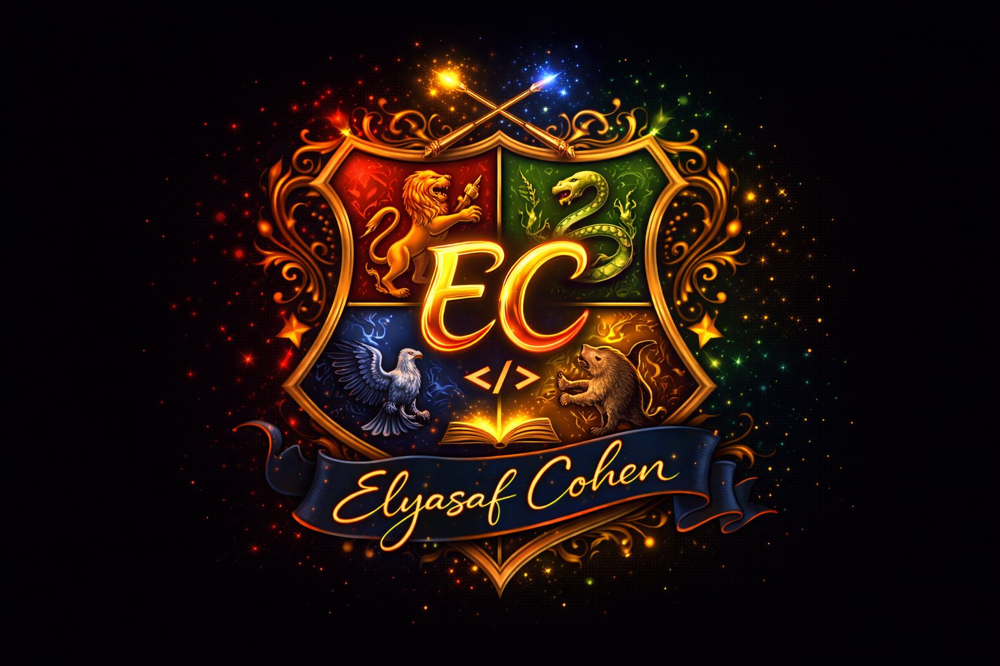

    

  

<h1 align="center">Hi, I'm Elyasaf Cohen 👋😎 </h1>

<h3 align="center">
Software Engineer | Full-Stack Developer | Creative Builder 🔮💻
</h3>

  
  

  

---

## ✨ About Me ✨

I'm a **Software Engineering student** and a passionate **full-stack developer** who loves building systems end-to-end —> from clean backend architecture to polished frontend experiences 🎨⚙️  

I enjoy combining **logic, creativity, and technology** to create meaningful projects -  
from management systems and APIs to games and interactive applications. 🥳🪄

---

## 🛠️ Tech Stack 🛠️

### 💻 Backend:

### ⚛️ Frontend:

### 🐍 Python & GUI:

---

## 🚀 Featured Projects 🚀

- 📈 **[Investment Advisor Project](https://github.com/ElyasafCohen100/Investment-Advisor-Project)** - AI powered stock portfolio manager
  
- 🚁 **[Drone Delivery Manager](https://github.com/ElyasafCohen100/Drone-Delivery-Manager)** – multi layer system with live simulator
 
- 📱 **[React PhoneBook App](https://github.com/ElyasafCohen100/React-PhoneBook-App)** – modern UI with Redux & MUI
 
- 🐶 **[Doggy Bones Game](https://github.com/ElyasafCohen100/Doggy-bones-game)** – fun arcade game built with Processing  

---

## 📊 GitHub Stats 📊

  Real-time activity • Streak intelligence • Contribution analytics

### 🔥 Official Contribution Overview 

  

 

---

### 🏁 Custom Activity Engine 

  

  Built & maintained by Elyasaf Cohen • Powered by GitHub API

---

## 🌱 Currently Learning 🌱
-  🤖 AI-driven systems & LLM integrations
  
-  🧠 Neural Networks & practical ML
    
-  🏗️ Designing scalable backend architectures
      
-  🎮 Creative coding & interactive experiences

---

## 🤝 Let's Connect 🤝

  

                                            

                    
  

---

> ✨ Built with curiosity, consistency, and good vibes ✨ 
